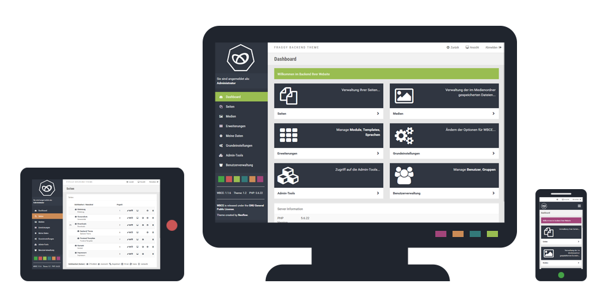

Fraggy Backend Theme is a responsive and Bootstrap based template for the backend of [WBCE](http://wbce.org)

**Attention:** There might be some design issues at the backend of older modules, but usually the modules still work as expected.



# Download

You can download the newest source code release and the distributed release without source files [here](https://github.com/rjgamer/Fraggy-Backend-Theme/releases).

# License

Fraggy Backend Theme is licensed under the MIT license for all non-commercial, personal, or open source projects and websites.

A commercial license is required for all commercial websites (e.g. every company website or personal website when your selling products or offering services).

## Commercial licensing

Purchasing is done by Binpress and only takes seconds. Once purchased, you'll receive a commercial license PDF and you are allowed to use Fraggy Backend Theme in your commercial applications.

There are two types of commercial licenses for Fraggy Backend Theme.

COMMERCIAL | EXTENDED
:------------: | :-------------:
Limited to 1 commercial website | Unlimited commercial websites
Future updates | Future updates
***14 EURO*** | ***149 EURO***

You can buy the license [here](#).

## License conditions

* You are not allowed to give away or resell a commercial license.
* The license don't guarantee any support or development.
* The support is provided by the community in the forum of [WBCE](http://wbce.org).
* 10% of the license fees are donated to [WBCE](http://wbce.org).

# Installation

## Theme

If you are installing the theme for the first time, use the template installation in the WBCE backend and follow the instructions.

**Attention:** If you want to update the backend theme, then you have to uninstall the old installation first!

## Theme logo

If you want to replace the default theme logo, then you have to create a logo image called theme-logo.png and replace the existing one in the image folder of your backend theme installation.

**Attention:** The logo must be a PNG-based image and should have a max width of 250px and a max height of 86px.

# Changelog

You can see the summary of releases and the changes in each release [here](https://github.com/rjgamer/Fraggy-Backend-Theme/releases).

# Author

* Jonathan Nessier, [Neoflow](https://www.neoflow.ch)

Thanks to the [WBCE](http://wbce.org) community for your support and testing.

Copyright © 2016-2017 Jonathan Nessier, [Neoflow](https://www.neoflow.ch) | Licensed under MIT


Text can be **bold**, _italic_, or ~~strikethrough~~.

[Link to another page](another-page).

There should be whitespace between paragraphs.

There should be whitespace between paragraphs. We recommend including a README, or a file with information about your project.

# [](#header-1)Header 1

This is a normal paragraph following a header. GitHub is a code hosting platform for version control and collaboration. It lets you and others work together on projects from anywhere.

## [](#header-2)Header 2

> This is a blockquote following a header.
>
> When something is important enough, you do it even if the odds are not in your favor.

### [](#header-3)Header 3

```js
// Javascript code with syntax highlighting.
var fun = function lang(l) {
  dateformat.i18n = require('./lang/' + l)
  return true;
}
```

```ruby
# Ruby code with syntax highlighting
GitHubPages::Dependencies.gems.each do |gem, version|
  s.add_dependency(gem, "= #{version}")
end
```

#### [](#header-4)Header 4

*   This is an unordered list following a header.
*   This is an unordered list following a header.
*   This is an unordered list following a header.

##### [](#header-5)Header 5

1.  This is an ordered list following a header.
2.  This is an ordered list following a header.
3.  This is an ordered list following a header.

###### [](#header-6)Header 6

| head1        | head two          | three |
|:-------------|:------------------|:------|
| ok           | good swedish fish | nice  |
| out of stock | good and plenty   | nice  |
| ok           | good `oreos`      | hmm   |
| ok           | good `zoute` drop | yumm  |

### There's a horizontal rule below this.

* * *

### Here is an unordered list:

*   Item foo
*   Item bar
*   Item baz
*   Item zip

### And an ordered list:

1.  Item one
1.  Item two
1.  Item three
1.  Item four

### And a nested list:

- level 1 item
  - level 2 item
  - level 2 item
    - level 3 item
    - level 3 item
- level 1 item
  - level 2 item
  - level 2 item
  - level 2 item
- level 1 item
  - level 2 item
  - level 2 item
- level 1 item

### Small image


### Large image


### Definition lists can be used with HTML syntax.

<dl>
<dt>Name</dt>
<dd>Godzilla</dd>
<dt>Born</dt>
<dd>1952</dd>
<dt>Birthplace</dt>
<dd>Japan</dd>
<dt>Color</dt>
<dd>Green</dd>
</dl>

```
Long, single-line code blocks should not wrap. They should horizontally scroll if they are too long. This line should be long enough to demonstrate this.
```

```
The final element.
```
